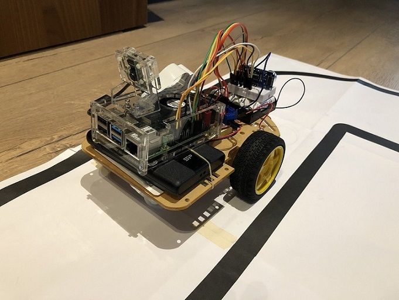
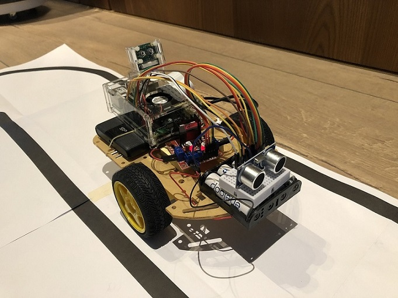
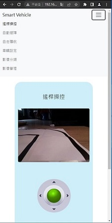
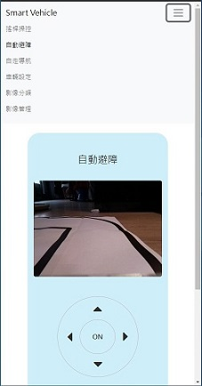
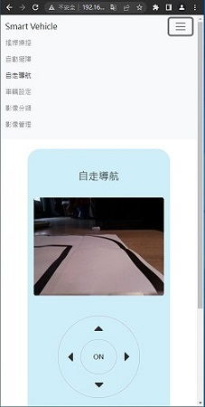
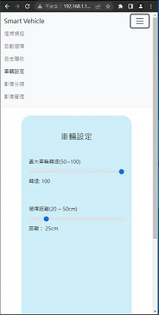
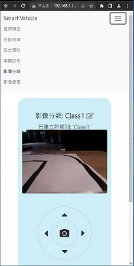
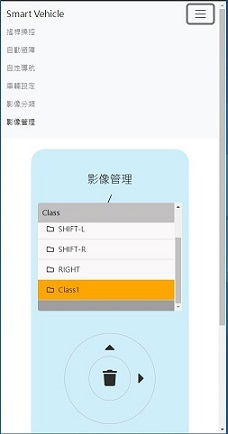

# 樹莓派智慧車專題介紹
這是一台基於樹莓派(Raspberry Pi)所開發，可 Wifi 遙控、自動避障及辨識固定車道的自走車。

   
# 系統說明
本車作品的硬體主要是使用 Raspberry Pi 4B作為控制器，搭配Raspberry Pi相機模組 + 直流馬達 + L298N馬達控制模組 + HC-SR04超音波感測器所組成。而在軟體方面，後端的車輛控制程式是以Python + Flask框架來撰寫，前端的操作介面是以 JavaScript/Bootstrap/jQuery 所設計的網頁，前後端之間則使用 AJAX 及 RESTful API 來進行請求與回應。另外，辨識車道的功能則是運用 Google Teachable Machine 所訓練出來的 TensorFlow.js 模型在前端網頁介面進行影像辨識。
# 功能及畫面
### __搖桿操控__ : 
可使用網頁元件模擬搖桿來操控自走車的移動(360度無方向限制)，並在頁面中顯示相機的串流視訊。
### __自動避障__ : 
在所設定的距離內，遇障礙物即會閃避轉向，並在頁面中顯示相機的串流視訊。
### __自走導航__ :
在固定的車道內，利用頁面中顯示的相機串流視訊，以及事先訓練好的車道辨識模型來預測判斷車道方向，進而使自走車可依循車道而行。本車道辨識模型係運用 Google Teachable Machine 的影像辨識專案來訓練，並將訓練後的模型轉為 TensorFlow.js 程式碼套用在本專題的前端操作頁面。
### __車輛設定__ :
可設定車輛的車速(車輪轉速)及自動避障的距離
### __影像分類__ :
可直接由車上相機模組拍攝車道影像並予以分類，以便後續上傳 Google Teachable Machine 來訓練辨識車道的模型
### __影像管理__ :
管理上述影像的分類(預覽及刪除)

 \
 其中自走導航、自動避障及搖桿操控的功能展示可參見以下的示範影片\
 [示範影片](https://drive.google.com/file/d/1L5Ju-7QDLeqkHxzF9uJoKgb4BfeYAvu7/view?usp=sharing)
# 環境設置
本專題的車輛控制程式是設置在 Python虛擬環境(virtual environment)中，並需額外安裝某些Python套件，請見 requirements.txt 檔。在虛擬環境中安裝方式如下(虛擬環境請自行建立):
    
    pip install -r requirements.txt
影像管理功能會使用到 SQLite 資料庫軟體，安裝方式如下:

    sudo apt update
    sudo apt upgrade
    sudo apt install sqlite3
安裝後請匯入 imgClass.sql 以建立資料表
# 執行專案

    python piCar.py
如上指令，執行主程式 piCar.py 後即可啟動 Flask，再以瀏覽器開啟 Flask 提示的 IP位址，即可開啟本系統的操作頁面。
# 資料夾說明
* __static/__
    * _css/_ : 前端HTML網頁介面會用到的 CSS 檔
    * _js/_ : 前端HTML網頁介面會引用到的 javascript 函式庫
    * _image/_ : 前端HTML網頁介面會引用到的圖檔
    * _imgClass/_ : 相機模組所拍攝照片檔之儲存路徑(動態建立)
    * _my_model/_ : 由 Google Teachable Machine 所訓練出來，用來辨識車道的 TensorFlow.js 影像辨識模型(指模型本身，而函式庫則放在上述 js/資料夾中)
* __templates/__ : 前端網頁介面之存放路徑
* __imgClass.sql__ : 建立資料庫資料表所需的 sql指令
* __piCar.py__ : 本專題執行檔
* __requirements.txt__ : 記錄本專題所需安裝的 Python 套件
# 專題技術
* Python Flask
* AJAX
* RESTful API
* Bootstrap
* jQuery
* TensorFlow.js
